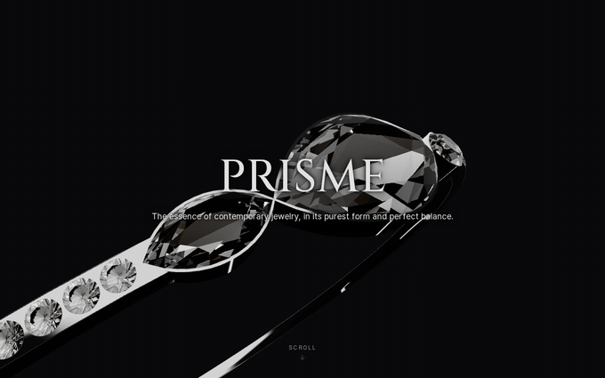
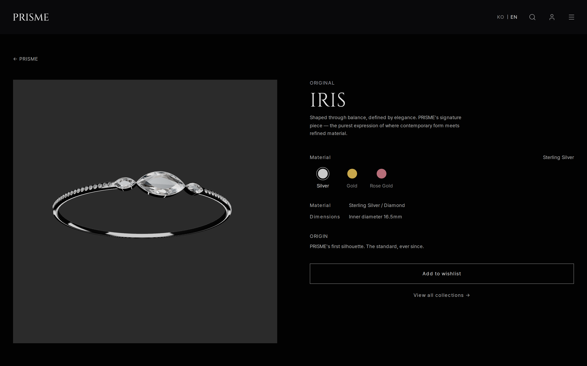
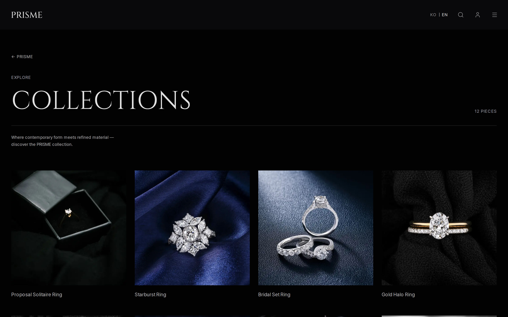
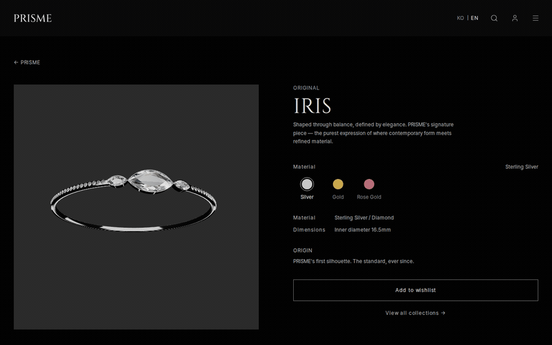
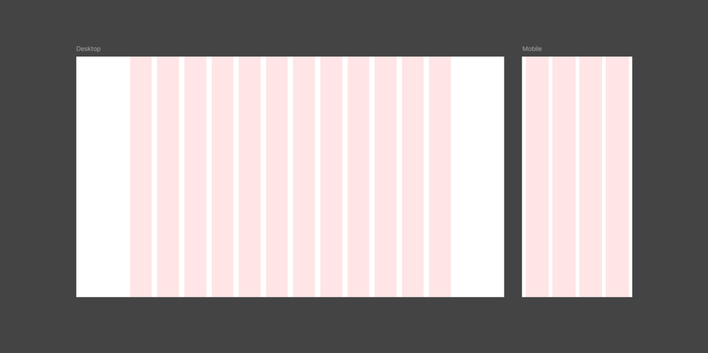

# PRISME

가상의 주얼리 브랜드 PRISME를 주제로 제작한 프론트엔드 파이널 프로젝트입니다.
기획, 디자인, 프론트엔드 개발, 3D 에셋 제작까지 1인으로 진행했습니다.

**Live Demo:** [project-carat.vercel.app](https://project-carat.vercel.app/)



---

## 스크린샷


_IRIS ORIGINAL — Iris 시그니처 피스_


_Collections — 에디토리얼 그리드_

---

## 프로젝트 목표


주얼리 브랜드 쇼케이스 웹사이트는 몰입을 유도하는 비주얼, 브랜드와 주얼리 컬렉션에 대해 사용자에게 각인시킬 수 있는 스토리텔링이 핵심이라고 생각했습니다.

그래서 장바구니, 구매, 결제 중심의 쇼핑몰 구조 대신 스크롤 중심의 에디토리얼 레이아웃, 3D 히어로를 활용한 브랜드 인트로, 컬렉션별 스토리텔링, 절제된 인터랙션을 통해 사용자가 브랜드를 탐색하는 과정 자체를 설계하는 데 집중했습니다.

---

## 3D 히어로 섹션

첫 화면의 반지는 모델링부터 텍스처링을 직접 진행한 모델입니다. 브랜드의 첫인상을 정지된 이미지가 아니라 스크롤에 반응하는 하나의 장면으로 설계하고 싶었습니다.
3D 섹션의 비주얼 작업 단계에서는 스크롤을 내릴 때 반지가 어떻게 회전해야 하는지, 어떻게 라이팅 처리를 해야 시각적으로 임팩트가 있어 보일지에 대해 고민했고, 어떻게 하면 3D가 의미를 가지고 사이트에 녹아들 수 있을까 고민했습니다.

동일한 에셋이 첫 화면에서는 시선을 끌고 강렬함을 주는 비주얼 역할을 하면서, 스크롤을 통해서는 자연스럽게 시선을 유도하고 인상적인 경험을 선사하고, 스크롤 끝에서는 시그니처 컬렉션 그 자체이자 섹션의 키 비주얼이 되도록 신경썼습니다. 
또 동일한 모델을 IRIS ORIGINAL 페이지 내부에 인터랙티브 요소로 활용해 여정이 자연스럽게 끝까지 이어지도록 하려 했습니다.

### 모델링

거들(girdle)을 감싸는 메탈 밴드, 밴드에 물린 마퀴즈(marquise) 스톤 3개, 밴드 양쪽을 장식하는 파베(pavé) 스톤 구조를 Blender로 직접 모델링하고, 카메라에 역동적인 구도로 잡히면서 마퀴즈 스톤의 반짝임이 잘 보이도록 기본 구도를 잡았습니다.
현대적이면서 둔하지 않고 날렵하고 세련된 인상을 주기 위해 둥근 컷보단 길고 양 끝이 뾰족한 마퀴즈 스톤을 선택했습니다. 보석을 감싸는 메탈 밴드는 가능한 얇게 모델링했습니다. 시선이 스톤으로 자연스럽게 향하도록 하고, 반지 실루엣이 둔하고 무겁게 보이는 인상을 줄이기 위해서였습니다.

### 재질

금속과 보석에 각각 PBR 재질을 입힌 뒤 glTF(`.glb`)로 내보냈습니다. 금속과 보석에 각각 PBR 재질을 입힌 뒤 glTF(.glb)로 내보냈습니다. 톤매핑은 ACES와 Khronos PBR Neutral 두 가지를 렌더링 결과로 직접 비교했습니다. ACES 적용 시 스톤과 폴리시드 메탈의 대비가 눈에 띄게 약해지는 반면, Neutral은 그 대비를 더 선명하게 유지했습니다. 주얼리다운 광택이 중요한 장면이었기 때문에 시각적 결과를 기준으로 Neutral을 최종 선택했습니다.

### 씬 통합

React Three Fiber + drei(`useGLTF`)로 모델을 로드하고, 스튜디오 환경맵과 BVH 기반 per-facet 반사를 적용해 별도 배경 없이도 각 면에서 광채가 살아나도록 구성했습니다. 모델은 `preload`로 미리 받아 첫 진입 시 지연을 줄였습니다.
같은 모델을 IRIS ORIGINAL 페이지에서는 드래그로 회전 가능한 오빗 뷰어로 재사용합니다.



### 스크롤 애니메이팅

맨 위 GIF에서 보이는 움직임이 이 부분입니다. 스크롤 진행도를 `requestAnimationFrame` 루프에서 부드럽게 보간(lerp)해, 반지가 화면을 가로지르며 이동·회전(Z roll·pitch)하고 텍스트 레이아웃과 맞물리도록 만들었습니다. 여기에 마우스 움직임 기반 패럴랙스 틸트를 스크롤 모션과 분리된 레이어로 얹어 결합도를 낮추려 했습니다.

`prefers-reduced-motion` 환경과 WebGL 미지원 환경에서는 각각 모션을 절제하거나 정지 이미지 폴백을 제공합니다.

---

## 설계 과정에서 중요하게 다룬 부분

### 레이아웃 구조

메인 페이지는 섹션마다 역할이 크게 달랐습니다. 또한 최대 너비와 반응형 패딩을 페이지 전체에서 일관되게 관리할 필요가 있었습니다. 이를 위해 Viewport, Section, Container의 책임을 분리하는 구조를 선택했습니다.

```
Viewport
 └ Section      ← 배경색·풀블리드 담당
    └ Container ← 최대 너비(1440px)·반응형 패딩·실제 컨텐츠 영역 담당
```

이 구조를 전 페이지에 걸쳐 일관되게 적용했습니다. 섹션은 화면 전체를 채우면서도 안쪽 콘텐츠는 화면이 좁아질수록 가장자리에서 적절히 떨어지도록, 반응형 패딩(`px-4 sm:px-6 lg:px-8`)을 컨테이너 단위로 관리했습니다.

이 3단 구조와 패딩 값은 피그마 그리드 시스템으로 먼저 설계했습니다. 뷰포트 역할을 하는 프레임(전체 너비) 안에 섹션 구분·배경을 담당하는 섹션 프레임을 두고, 그 안의 콘텐츠 프레임을 Fill·최대 너비 제약으로 배치하는 구조로 잡았습니다. 그리드는 모바일은 4칼럼·마진 16·거터 16, 데스크탑은 최대 너비 제한이 1440px인 컨테이너 안에서 양옆 여백 없이 거터가 24인 12컬럼을 기준으로 삼았습니다. 다만 카드처럼 폭이 좁아지면 안 되는 컴포넌트는 모바일에서 그리드 2칸을 차지하도록 해서, 4칼럼 그리드 자체는 유지하되 컴포넌트가 가로로 지나치게 좁아지지 않게 했습니다.


_데스크탑 12컬럼(거터 24px)과 모바일 4컬럼(마진·거터 16px) 그리드를 피그마에서 각각 설계한 모습입니다._

뷰포트가 특정 너비(1440px)를 넘어서면 `mx-auto`로 인해 컨테이너가 가운데 정렬이 되면서 시각적으로 여백이 생기므로 데스크탑엔 별도 패딩이 필요 없다고 판단했습니다. 다만 화면이 1440px보다 좁아지기 시작하는 구간부터는 콘텐츠 영역이 전체 화면을 가득 채우게 되는데, 여기서 패딩이 없다면 콘텐츠가 화면 가장자리에 그대로 붙어버립니다. 그래서 해당 브레이크포인트 이하부터는 양 옆에 패딩을 두었습니다.

히어로 섹션은 의도적으로 컨테이너를 두지 않았습니다. 에디토리얼 첫 화면처럼 타이포그래피가 뷰포트 전체에 걸쳐 펼쳐지는 첫인상을 원했기 때문입니다.

### 반응형

화면 크기에 따라 레이아웃을 줄이는 데 그치지 않고, 좁은 화면에 맞는 조작 방식으로 바꾸는 것을 기준으로 삼았습니다. 상품 상세에서는 데스크탑에 breadcrumb을, 모바일에는 뒤로가기 버튼을 두었고, 같은 컬렉션의 다른 피스는 좁은 화면에서 가로 스크롤로 탐색하도록 했습니다. 반응형 패딩과 타이포그래피 스케일은 앞서의 컨테이너·토큰 단위로 관리해 페이지마다 따로 조정하지 않도록 했습니다.

### 3D 씬과 로딩 화면 동기화

로딩 화면이 실제 상태와 연관되지 않은 정적인 애니메이션인 경우, 네트워크가 느린 환경이나 저사양 디바이스에서는 아직 3D 씬이 준비되지 않았는데 애니메이션이 먼저 끝나 검은 화면이 노출될 가능성이 있었습니다.
또 로딩 화면 동기화 처리만 할 경우, 로딩 진행이 매우 빠르게 완료되는 환경에서는 로딩이 과도하게 빨리 지나가 번쩍임을 유발함에 이어, 히어로 씬으로 매끄럽지 않게 전환되는 문제가 있을 것이라 판단했습니다.

씬이 준비됐을 때 신호를 보내고, 로딩 화면이 그 신호를 받은 뒤에만 사라지는 구조를 선택했습니다. 최소 표시 시간(1.6초)도 두었는데, 로딩 화면이 지나치게 짧게 깜빡여 사용자가 불편한 번쩍임을 겪는 것을 막기 위함입니다.

### 모달의 포커스 관리

키보드로만 탐색하는 사용자에게 모달은 함정이 될 수 있습니다. 열린 모달 바깥으로 포커스가 빠져나가면 사용자는 어디 있는지 알 수 없게 됩니다.

모달과 내비게이션 드로어 모두 Tab 이동이 내부에서만 순환하도록 포커스 트랩을 적용했습니다.

로그인 모달에서는 한 가지 결정을 더 했습니다. 입력 중에 실수로 닫기를 눌렀을 때 입력값이 그냥 사라지면 불편하다고 판단해, 확인 오버레이를 먼저 띄우는 방식을 선택했습니다. 이때 오버레이 뒤의 폼에 `inert` 속성을 적용해 키보드 포커스가 뒤로 이동하지 못하도록 했고, 오버레이가 닫히면 포커스가 자동으로 닫기 버튼으로 돌아오도록 했습니다.

### 디자인 토큰 시스템

14개 페이지를 작업하면서 매번 색상값을 직접 고르면 미묘한 불일치가 생길 것 같았습니다. 그래서 색상을 값이 아닌 역할 이름으로 관리하는 방향을 택했습니다.

```
content-primary / secondary / … / faint    텍스트 계층 (7단계)
surface-base / raised / elevated / …        배경 계층 (7단계)
```

새 컴포넌트를 추가할 때 구체적인 색상을 고르는 대신 "이 텍스트는 보조 역할"처럼 역할만 결정하면 됩니다.

자간(letter-spacing)은 원시 스케일(`tracking-1`~`6`)과 그것을 참조하는 시맨틱 토큰(`tracking-heading`·`logo`·`link` 등)의 2단 구조로 나눠, 값은 한곳에서 관리하고 컴포넌트는 쓰임새 이름만 참조하도록 했습니다. 자주 쓰는 마이크로 폰트 크기(`text-2xs` 등)도 토큰화해 임의값이 흩어지는 것을 막았습니다.

같은 역할 토큰은 다크·라이트 두 테마에서 각각 완결된 값을 갖도록 두 팔레트를 함께 설계했습니다. 테마 전환은 컴포넌트를 다시 그리지 않고 CSS 변수 값만 교체되는 방식으로 동작합니다.

구현은 Tailwind v4의 CSS-first 방식을 따랐습니다. 별도 설정 파일 없이 `globals.css`의 `@theme` 블록에서 토큰을 정의하고, 색상은 기본적으로 `oklch`로 관리하되 이를 지원하지 않는 구형 브라우저를 위해 hex·rgba 폴백을 함께 두었습니다.

### 퍼지 검색

사용자가 정확한 상품명을 외우고 있다고 가정하는 검색은 현실적이지 않다고 생각했습니다. "은반지", "14k" 같은 단편적인 단어로도, 오타가 섞여도 관련 결과가 나와 사용자 행동이 끊기지 않아야 한다고 생각했습니다.

상품명·소재·카테고리를 함께 탐색하며, 완전 일치가 아닌 유사도 기반으로 결과를 노출하는 방향을 선택했습니다.

### 커스텀 커서

기본 커서 대신, 점과 그 뒤를 지연 추적하는 링 두 겹으로 구성한 커서를 두었습니다. 링은 링크나 버튼 위에서 미세하게 커져 상호작용 가능한 요소를 알려줍니다. 브랜드 톤에 맞게 개입을 최소화하되, 휠 클릭 시에는 방향 표시가 있는 오토스크롤 커서로 전환되도록 했습니다.

과하게 쓰이지 않도록 조건도 두었습니다. 마우스를 쓰는 환경(`pointer: fine`)에서만 적용하고 터치·펜 디바이스에서는 기본 커서를 유지하며, `prefers-reduced-motion` 환경에서는 지연 추적을 끕니다. 커서 요소는 모두 `aria-hidden`으로 처리해 보조 기술 탐색에 끼어들지 않도록 했습니다.

---

## 접근성

- Skip Link 제공
- 커스텀 Focus Ring 적용
- `prefers-reduced-motion` 지원
- ARIA 속성 적용
- 시맨틱 HTML 구조 사용

---

## 화면 구조

```
app/
├── /                        홈: 3D 히어로 · 시즌 배너 · Best Pieces · 컬렉션 소개
├── /essential               IRIS ORIGINAL: 컬러 선택형 제품 상세
├── /best-pieces             Best Pieces
├── /collections             Collections
├── /fw-collections          FW Collections
├── /archive                 Archive
├── /products/[id]           상품 상세 (동적 라우트)
├── /search                  검색 결과
├── /wishlist                위시리스트 (로그인 필요)
├── /materials               소재 소개
├── /process                 제작 과정
├── /care-guide              관리 가이드
├── /faq                     FAQ
├── /contact                 문의
├── /shipping                배송 안내
└── 404                      존재하지 않는 경로
```

---

## 유저 플로우

```
진입
  ├─ 홈 (/)
  │   ├─ 컬렉션 탐색
  │   │   ├─ /collections · /best-pieces · /fw-collections · /archive
  │   │   └─ 상품 클릭 → /products/:id
  │   │         ├─ 위시리스트 추가 → [인증 분기]
  │   │         ├─ 같은 컬렉션 다른 피스 클릭 → /products/:id
  │   │         └─ 컨텍스트 링크 클릭 → /materials · /care-guide
  │   │
  │   ├─ IRIS ORIGINAL → /essential
  │   │   └─ 컬러 선택 → 위시리스트 추가 → [인증 분기]
  │   │
  │   └─ 검색 → /search?q=...
  │         └─ 결과 클릭 → /products/:id
  │
  ├─ 위시리스트 (/wishlist) ── 로그인 필요
  │
  ├─ 브랜드 탐색
  │   └─ /materials · /process · /care-guide · /archive
  │
  └─ 고객 지원
      ├─ /faq · /shipping
      └─ /contact ── 폼 작성 → 전송
```

---

## UX 분기

### `/search`

```
q 없음
  └─ 빈 상태 안내

q 있음
  ├─ 직접 매칭 있음     → 결과 그리드
  ├─ 연관 상품 있음     → 연관 섹션 (직접 매칭과 공존 가능)
  ├─ 오타 감지됨        → 교정 제안 배너
  └─ 아무 결과 없음     → "결과 없음" 안내
```

### `/products/:id`

```
id 유효    → 제품 상세 렌더
            ├─ 데스크탑: breadcrumb (PRISME › 컬렉션 › 제품명)
            ├─ 모바일: 뒤로가기 버튼
            ├─ 같은 컬렉션 다른 피스 가로 스크롤 → 피스 클릭 → /products/:id
            └─ 소재 · 관리 가이드 컨텍스트 링크 → /materials · /care-guide
id 없음    → 404
```

### `/essential`

```
컬러 선택 (gold / silver / rose-gold)
  └─ 3D 재질의 금속 색상·러프니스 실시간 변경 (스와치 UI 색과는 별도 값)
     └─ 위시리스트 항목 id도 선택에 따라 변경 (essential-gold 등)
```

### `/wishlist`

```
비로그인    → 렌더 중단 + 로그인 모달 자동 오픈
로그인
  ├─ 위시리스트 있음    → 상품 그리드
  └─ 위시리스트 없음    → 빈 상태 안내
```

### `/contact`

```
전송 시도
  ├─ 이름 비어있음      → 이름 에러
  ├─ 이메일 오형식      → 이메일 에러
  └─ 메시지 비어있음    → 메시지 에러

touch 이후    → 필드별 실시간 유효성 재검사
전송 성공     → 성공 상태
```

---

## 전역 상태

테마와 언어는 모든 페이지에 공통으로 적용되는 설정입니다. 페이지 라우팅이나 콘텐츠 블록을 바꾸지 않고, 각 페이지의 UX 분기와 독립적으로 동작합니다. 인증도 전역으로 관리하지만, 유일하게 특정 페이지(위시리스트)의 렌더링 여부를 직접 좌우한다는 점에서 다릅니다.

### 테마 (`dark` / `light`)

```
진입
  └─ localStorage에 저장된 값?
      ├─ 있음    → 사용자 명시 선택 적용
      └─ 없음    → OS prefers-color-scheme 감지
                     └─ OS 변경 시 실시간 반영 (사용자 미선택 상태에서만)
```

### 언어 (`ko` / `en`)

```
진입
  └─ localStorage / 쿠키에 저장된 값?
      ├─ 있음    → 저장된 언어 적용
      └─ 없음    → navigator.language 감지 (ko 접두사 → ko, 그 외 → en)
```

### 인증

```
비로그인 상태에서 /wishlist 진입
  └─ 렌더 중단 + 로그인 모달 자동 오픈

로그인 모달
  ├─ 닫기 시도 (입력값 있음)    → 확인 오버레이 (실수 방지)
  └─ 로그인 성공                → 모달 닫힘, 페이지 콘텐츠 렌더
```

---

## 기술 스택

| 분야      | 기술                               |
| --------- | ---------------------------------- |
| Framework | Next.js 16, React 19, TypeScript   |
| Styling   | Tailwind CSS v4 (디자인 토큰)      |
| 상태 관리 | React Context (테마 · 언어 · 인증) |
| 다국어    | 자체 구현 (ko · en)                |
| 3D 에셋   | Blender (모델링 · 텍스처링)        |
| 3D 렌더링 | Three.js, React Three Fiber, drei  |
| Animation | Framer Motion                      |
| Typeface  | Cinzel, Pretendard                 |

---

## 실행

```bash
npm install
npm run dev
```

브라우저에서 `http://localhost:3000` 으로 접속합니다.

---

## 이미지 출처

히어로의 3D 반지는 직접 디자인·모델링·텍스처링한 에셋이며, 제품 목록의 주얼리 사진은 [Pexels](https://www.pexels.com)의 무료 스톡 이미지를 사용했습니다.

## 라이선스

이 저장소는 포트폴리오 열람 목적으로 공개되어 있습니다.
사전 동의 없는 복제·재배포·상업적 이용을 금지합니다. 자세한 내용은 [LICENSE](LICENSE)를 참고하세요.

© 2026 hyeonwoo1231. All Rights Reserved.
