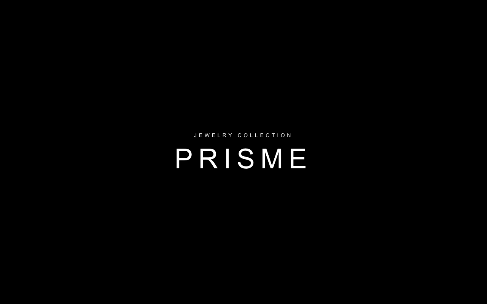
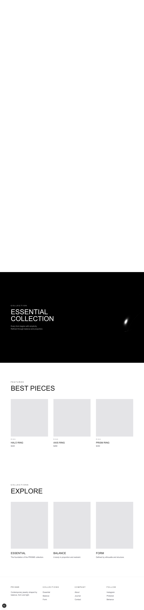
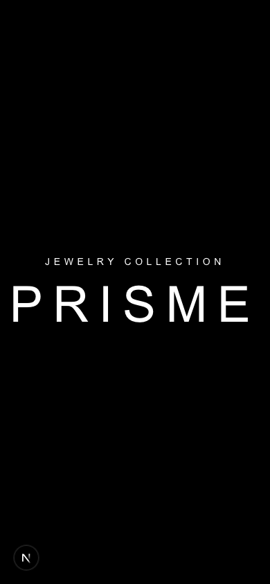
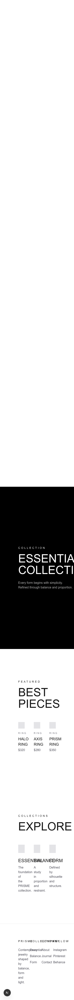

# carat 3차 코드 리뷰 (2026-06-10)

> 대상: `carat`(옛 facet) · 박현우 · 1인 조
> 범위: 커밋 `4c480b2 컴포넌트 생성 및 메인 페이지 초안 완료`(06-09) — 처음 들어온 실제 화면 작업
> 기준 브랜치: `main`

이번에 처음으로 진짜 화면이 들어왔습니다. PRISME 라는 주얼리 브랜드 랜딩 페이지인데,
스크롤에 맞춰 3D 링이 회전·이동하는 히어로까지 직접 붙였더군요. 디자이너 출신답게
타이포·여백·톤이 정돈돼 있어서, 데스크톱 화면은 그대로 포트폴리오에 써도 될 만큼 완성도가 좋습니다.
아래는 지난 지적 반영 현황 → 이번 화면 리뷰 → E2E 결과 순서로 정리했습니다.

---

## 1. 지난 리뷰(1차) 반영 현황

1차 지적은 2차까지 코드 변경이 없어 그대로 넘어왔습니다. 이번 커밋 기준으로 다시 대조해 봤습니다.

| 지적 | 위치 | 상태 | 메모 |
| ---- | ---- | ---- | ---- |
| [필수] metadata "Create Next App" → 서비스명/설명 | `layout.tsx:16-17` | 미해결 | 여전히 기본값. PRISME로 바꿀 좋은 타이밍입니다 |
| [필수] `html lang="en"` → 한국어면 `ko` | `layout.tsx:27` | 미해결 | 본문 카피가 전부 영어라 이번엔 `en`도 의도일 수 있습니다(아래 질문) |
| [제안] globals.css `font-family: Arial`와 Geist 변수 충돌 | `globals.css:25` | 미해결 | Geist를 불러놓고 body는 Arial로 덮고 있습니다 |
| [제안] 인라인 hex 색 → @theme 토큰화 | (구 page.tsx) | 해당 없음 | 옛 템플릿 page.tsx가 통째로 교체돼 그 코드는 사라졌습니다. 대신 새 코드의 색 토큰화 얘기를 아래에서 이어갑니다 |

다그치려는 게 아니라 진행 상황을 먼저 맞추고 싶어서 묻습니다.

- metadata와 `lang`은 화면에 안 보이는 부분이라 화면 작업에 집중하느라 뒤로 미루신 건가요?
  아니면 따로 둘 이유가 있으셨나요? metadata는 SEO·브라우저 탭·SNS 공유 미리보기에 바로 드러나는
  부분이라, 이번 커밋에 한 줄씩만 같이 고쳐두면 깔끔할 것 같습니다.
- `lang`은 — 카피가 전부 영어라 영어 사이트로 가는 거라면 `en`이 맞습니다. 그 의도라면 그대로 둬도 됩니다.
  한국어 UI가 섞일 계획이면 그때 `ko`로 바꾸면 됩니다. 어느 쪽으로 생각 중이신가요?

---

## 2. 이번 화면 리뷰 (박현우)

### 잘한 점부터

- **스크롤 연동 3D 히어로가 인상적입니다.** `Hero.tsx`에서 `h-[400vh]` 안에 `sticky top-0`로
  화면을 고정해 두고, `window.scrollY / (innerHeight*3)`로 0~1 진행도를 만든 다음
  구간별(0.3~0.6 회전 / 0.6~0.8 이동)로 링을 움직이는 구성이 깔끔합니다. 스크롤 스토리텔링의
  정공법이라 생각합니다.
- **부드럽게 따라오는 처리(lerp)가 좋습니다.** `setProgress(prev => prev + (target - prev) * 0.08)`로
  목표값을 향해 매 프레임 보간하는 방식인데, 스크롤 값에 화면을 바로 붙이지 않고 한 박자 쫓아오게 만들어
  움직임이 매끄럽습니다. 초보 단계에서 이 패턴을 직접 쓴 건 칭찬할 만합니다.
- **easing 함수를 분리**(`easeOutCubic`, `easeInOutCubic`)해 둔 것, **cleanup**에서
  `removeEventListener`와 `cancelAnimationFrame`을 둘 다 해제한 것 — 메모리 누수·중복 루프를
  막는 좋은 습관입니다.
- **컴포넌트를 의미 단위로 잘 쪼갰습니다.** `Hero / BestPieces / Collections / Footer`로 나누고,
  카드(`ProductCard`, `CollectionCard`)는 props로 데이터를 받게 만들어 재사용 구조를 잡았습니다.
  `page.tsx`가 섹션 조립만 하는 형태라 읽기 좋습니다.
- **시맨틱 태그**도 잘 챙겼습니다. `main / section / article / footer`, 카드의 제목을 `h3`로,
  `ProductCard`에 `group`을 걸어 hover 확장을 준비해 둔 점 모두 좋습니다.

### [필수] 반응형이 아직 없어 모바일에서 레이아웃이 깨집니다

이번 화면의 가장 큰 항목입니다. 지금 모든 섹션이 데스크톱 고정값으로만 잡혀 있습니다.

- `BestPieces.tsx:5` `px-24` + `:14` `grid-cols-3`
- `Collections.tsx:5` `px-24` + `:14` `grid-cols-3`
- `Footer.tsx:3` `px-24` + `:4` `grid-cols-4`
- 제목들 `text-6xl` / `text-7xl` 고정

E2E로 390px(모바일)에서 띄워 보니, 가로 스크롤은 안 생기지만(`px-24`가 양옆을 6rem씩 먹어
콘텐츠 폭을 강제로 줄이기 때문) 대신 **3열·4열 그리드가 좁은 폭에 그대로 욱여넣어져
글자가 서로 겹쳐 읽을 수 없는 상태**가 됩니다. 특히 Footer 4열은 단어들이 포개져 버립니다.
(아래 E2E 캡처 `3rd-mobile-content.png` 참고.)

왜 이렇게 되냐면, Tailwind에서 `grid-cols-3`나 `px-24`는 **모든 화면폭에 무조건 적용**되는 값이라서
그렇습니다. 화면이 좁아져도 3열을 유지하려다 칸이 짜부라지는 거죠. 해결은 "**모바일을 기본값으로 두고,
넓어질 때만 열을 늘리는**" 모바일 퍼스트 방식입니다.

```tsx
// 지금 (데스크톱 고정)
<div className="grid grid-cols-3 gap-12">

// 권장 (모바일 1열 → md 2열 → lg 3열)
<div className="grid grid-cols-1 gap-8 md:grid-cols-2 lg:grid-cols-3">
```

여백·제목도 같은 식으로 단계를 줍니다.

```tsx
<section className="px-6 py-20 md:px-12 lg:px-24 md:py-40">
<h2 className="text-4xl md:text-6xl font-light">
```

Footer 4열도 `grid-cols-2 md:grid-cols-4` 정도면 모바일에서 2x2로 자연스럽게 접힙니다.
디자이너 출신이시니, Figma에서 모바일 프레임을 따로 잡아 두셨으면 그 분기점을 `sm/md/lg`에
그대로 옮기면 됩니다. (가이드 문서에 단계별로 적어뒀습니다.)

### [필수] 히어로(3D)의 모바일·로딩·접근성 대비

히어로 자체는 모바일에서 깨지진 않습니다(가운데 정렬이라). 다만 두 가지를 확인하고 싶습니다.

1. **`h-[400vh]` + `Canvas` 풀스크린이 모바일·저사양 기기에서 무겁지 않을까요?**
   three.js 캔버스가 매 프레임 도는 구조라, 모바일에서 발열·버벅임이 날 수 있습니다.
   당장 고칠 필요는 없지만, 나중에 `dpr={[1, 2]}`로 픽셀비를 제한하거나, 모바일에서는
   3D 대신 정적 이미지로 대체하는 선택지도 있다는 정도만 알아두시면 좋겠습니다.

2. **`prefers-reduced-motion` 대응** — 멀미·전정기관 이슈로 모션을 줄이도록 설정한 사용자가
   있습니다(접근성). 지금은 스크롤 모션이 항상 돕니다. 여유가 생기면
   `window.matchMedia("(prefers-reduced-motion: reduce)")`를 봐서 애니메이션을 약하게/끄는
   분기를 두면 접근성 점수가 올라갑니다. (이번엔 [제안] 수준으로만 봐 주세요.)

### [제안] `EssentialCollection.tsx`가 만들어졌지만 어디에도 안 쓰입니다

`src/components/EssentialCollection.tsx`를 만들어 두셨는데, `page.tsx`는 이 컴포넌트를 import하지
않습니다(Hero / BestPieces / Collections / Footer만 씁니다). 그리고 그 안의 카피("ESSENTIAL
COLLECTION ...")는 `Hero.tsx` 하단(181~208줄)에 이미 비슷하게 들어가 있더군요.

빌드에는 영향이 없지만(트리셰이킹으로 번들엔 안 들어갑니다), 읽는 사람 입장에선 "이건 쓰는 건가?"
헷갈립니다. 둘 중 하나로 정리하면 좋겠습니다.

- 히어로 안의 ESSENTIAL 블록을 떼서 이 `EssentialCollection` 컴포넌트로 빼내 `page.tsx`에 끼우거나,
- 안 쓸 거면 파일을 지워서 혼선을 없애거나.

지금 어느 쪽으로 가려던 중이었나요? 히어로 안에 둘지, 독립 섹션으로 뺄지에 따라 정리 방향이 갈립니다.

### [제안] 색·반복 클래스를 토큰/상수로 모으기

`tracking-[0.4em]`(섹션 라벨), `tracking-[0.3em]`(작은 제목), `text-zinc-600`(본문),
`bg-zinc-200`(이미지 자리), `text-6xl font-light`(섹션 제목) 같은 조합이 여러 컴포넌트에 반복됩니다.
지금 규모에선 문제 없지만, 디자인 값이 바뀌면 여러 파일을 동시에 손대야 합니다.

두 가지 방법이 있습니다.

- 자주 쓰는 색은 `globals.css`의 `@theme`에 토큰으로 올려 둡니다(1차 때 얘기한 토큰화의 연장선).
  ```css
  @theme inline {
    --color-muted: #71717a;   /* zinc-500 */
    --color-subtle: #52525b;  /* zinc-600 */
  }
  ```
- 라벨/제목처럼 통째로 반복되는 마크업은 작은 컴포넌트(`SectionLabel`, `SectionTitle`)로 빼면
  카피·간격을 한 곳에서 관리할 수 있습니다.

### [사소] 자잘한 것들

- **footer의 링크가 아직 텍스트입니다.** `Footer.tsx`의 `<li>Instagram</li>` 등은 실제 이동이
  없는 글자입니다. 자리만 잡아둔 초안인 건 알지만, 메뉴라면 `<a>`로 감싸야 키보드 Tab 이동·스크린리더
  인식이 됩니다. 링크 대상이 정해지면 `<li><a href="...">...</a></li>`로 바꿔 주세요.
- **이미지 자리(`bg-zinc-200` div)** 는 실제 제품 이미지가 들어올 자리로 보입니다. 그때
  `next/image`를 쓰고 `alt`를 꼭 채워 주세요(검색·접근성). 지금은 placeholder라 지적 아닙니다.
- **`PRISME`가 h1(히어로)과 h3(footer 브랜드)로 두 번** 나옵니다. 한 페이지에 같은 브랜드명이
  제목 레벨을 달리해 두 번 있는 건 문제는 아니지만, footer의 `PRISME`는 제목이라기보다 라벨에
  가까우니 의미상 그대로 둘지 한 번 생각해 보셔도 좋습니다. (E2E에서 이 둘 때문에 셀렉터가 두 개로
  잡혀서 `h1`으로 좁혔습니다 — 참고만.)
- **`AGENTS.md`의 three.js 경고** — 빌드/실행 로그에 `THREE.Clock: deprecated. Use THREE.Timer instead.`
  경고가 뜹니다. 동작엔 지장 없지만, three 버전이 올라가며 deprecated된 API가 내부에서 쓰이는 모양입니다.
  지금 직접 만질 부분은 아니고, 나중에 라이브러리 업데이트 때 참고만 해 두세요.

---

## 3. 정적 검증 (실측)

`npm install` 후 실제로 돌린 결과입니다.

- **`npx tsc --noEmit`** — 통과(에러 0). (install 전에는 `@react-three/fiber`·`three` 모듈을
  못 찾아 JSX intrinsic 에러가 떴는데, 의존성 설치 후 모두 사라졌습니다. 코드 타입 문제는 없습니다.)
- **`npm run build`** — 성공. `/`와 `/_not-found` 모두 정적(○ Static)으로 프리렌더됩니다.
  Hero가 `"use client"`라도 페이지 자체는 정적으로 떨어지고 3D만 클라이언트에서 도는 좋은 구조입니다.
  ```
  ✓ Compiled successfully
  ✓ Generating static pages (4/4)
  Route (app)
  ┌ ○ /
  └ ○ /_not-found
  ```

타입·빌드가 깨끗한 건 좋은 신호입니다. 잘 하셨습니다.

---

## 4. E2E 결과 (Playwright)

로그인이 없는 화면이라, 메인 페이지 렌더 + 반응형(모바일 390 / 데스크톱 1280) 캡처 위주로 가볍게
돌렸습니다. 테스트 코드는 `review/e2e/tests/carat-3rd.spec.ts`(리뷰 전용 작성), 서버는 `PORT=3105`.

| 시나리오 | 결과 |
| -------- | ---- |
| 데스크톱 1280 — 히어로 h1 "PRISME" 노출 → 캡처 | 통과 |
| 데스크톱 1280 — 스크롤 끝까지 → "BEST PIECES" 노출 → 풀페이지 캡처 | 통과 |
| 모바일 390 — 히어로 노출 → 캡처 | 통과 |
| 모바일 390 — 스크롤 끝 풀페이지 캡처 + 가로 넘침 측정 | 통과(가로 넘침 false) |

**캡처**

- 데스크톱 히어로 — `review/images/3rd-desktop-hero.png`
  
- 데스크톱 전체 — `review/images/3rd-desktop-content.png` (3D 링이 ESSENTIAL 섹션에서 렌더되는 게 보입니다)
  
- 모바일 히어로 — `review/images/3rd-mobile-hero.png`
  
- 모바일 전체 — `review/images/3rd-mobile-content.png` (그리드가 좁은 폭에 욱여넣어져 글자가 겹칩니다)
  

**발견한 것**

- 데스크톱은 의도대로 아름답게 렌더됩니다. 3D 링이 스크롤 위치에서 회전·이동하는 것도 동작합니다.
- 모바일은 위 [필수] 항목 그대로 — 그리드·여백·폰트가 고정값이라 콘텐츠 섹션의 글자가 겹쳐
  읽기 어렵습니다. 가로 스크롤(overflow)은 `false`로 안 생기지만, 이는 `px-24`가 폭을 강제로
  눌러서일 뿐 레이아웃이 정상이라는 뜻은 아닙니다. 반응형 분기를 넣으면 해결됩니다.

---

## 정리

- 처음 들어온 화면인데 3D 히어로·컴포넌트 분리·정적 빌드까지 토대가 단단합니다. 데스크톱 완성도가 특히 좋습니다.
- 이번에 꼭 챙길 것: **반응형 분기**(모바일에서 그리드/여백/폰트), 그리고 **안 쓰이는
  `EssentialCollection` 정리**입니다.
- 미뤄둔 1차 [필수](metadata, `lang`)는 한 줄씩이라 이번 커밋에 같이 얹으면 깔끔합니다.
  `lang`은 영어 사이트 의도면 그대로 둬도 됩니다 — 의도만 알려 주세요.

해결 방법은 같은 날짜의 `_가이드.md`에 단계별로 적어뒀습니다. 천천히, 그렇지만 꾸준히 갑시다. 화이팅입니다.
