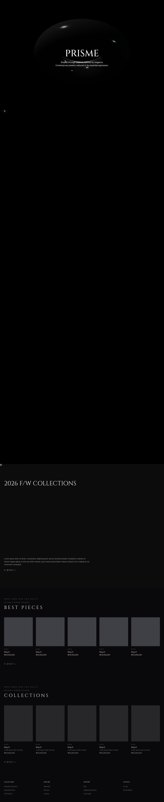
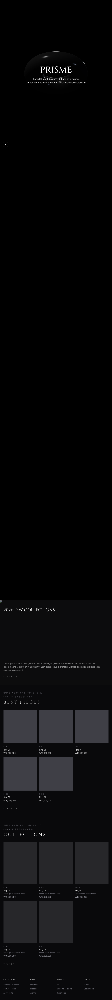
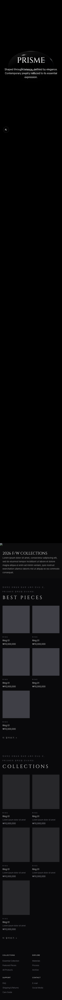
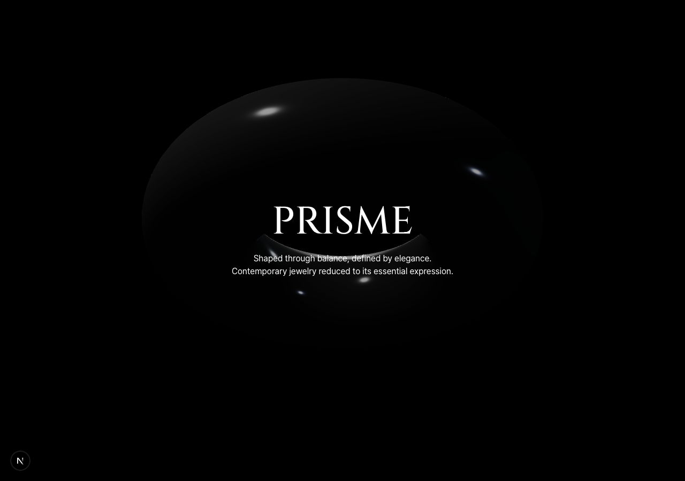
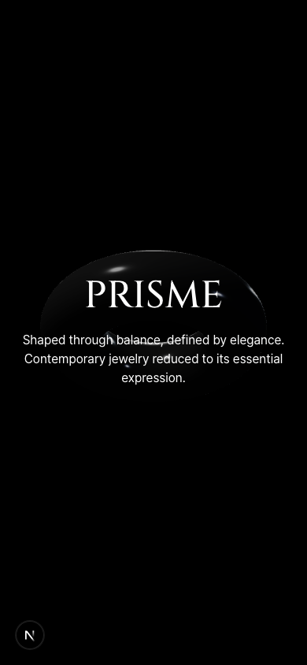

# PRISME 6차 리뷰 (2026-06-16)

5차(`5cdc108`) 이후로 코드가 꽤 움직였습니다. 14개 커밋이 들어왔는데, 핵심만 추리면 **반응형 도입**, **디자인 토큰 시스템 구축**, **유령 컴포넌트 정리**, **Navbar 추가**, **Hero 라이팅/애니메이션 손질**입니다. 무엇보다 지난 세 회차 동안 `[필수]`로 짚어온 반응형이 이번에 실제로 해결됐습니다. 그 부분부터 보겠습니다.

---

## 지난 리뷰 반영 현황

| 항목 | 등급 | 상태 |
|---|---|---|
| 반응형 분기 없음 | [필수] | **해결** — 전 섹션 `sm:`/`lg:` 단계 적용, 모바일 가로 오버플로 0 |
| `EssentialCollection.tsx` 유령 파일 | [제안] | **해결** — 파일 삭제 확인 |
| `html lang="en"` | [확인] | **변경됨** — `lang="ko"`로 바뀜 (`layout.tsx:82`) |
| metadata "Create Next App" → PRISME | [필수] | 해결(5차 확인) — 유지됨 |
| globals Arial → Pretendard 변수 | [제안] | 해결(5차 확인) — 유지됨 |
| 제품 이미지 `next/image` | [제안] | **부분 해결** — SeasonalBanner는 `next/image` 적용, 나머지 카드는 아직 이미지 자리 비어 있음 |

세 회차째 남아 있던 `[필수]` 반응형을 말이 아니라 **실제 동작하는 결과물**로 풀어낸 점이 이번 회차의 가장 큰 성과라 생각합니다. 아래에서 화면 근거와 함께 짚어보겠습니다.

---

## 잘한 점

### 반응형을 제대로 해결했습니다 (세 회차째 [필수] → 해결)

지난 회차까지 `src` 전체에 브레이크포인트가 0개였는데, 이번엔 `sm:` 26개, `lg:` 37개, `xl:` 3개가 들어왔습니다. 숫자만 늘어난 게 아니라 **레이아웃이 단계적으로 접히도록** 설계돼 있습니다.

```
src/components/BestPieces.tsx:34   grid-cols-2 sm:grid-cols-3 lg:grid-cols-5
src/components/Collections.tsx:54  grid-cols-2 sm:grid-cols-3 lg:grid-cols-5
src/components/Footer.tsx:4        grid-cols-2 sm:grid-cols-4
src/app/collections/page.tsx:34    grid-cols-2 sm:grid-cols-3 lg:grid-cols-4
```

BEST PIECES와 COLLECTIONS가 데스크톱 5열 → 태블릿 3열 → 모바일 2열로 자연스럽게 접힙니다. Footer도 4열 → 2열로 내려가고요. 그리고 여백 처리를 **패딩 고정에서 `max-w-container mx-auto` + `px-4 sm:px-6 lg:px-8` 구조로 바꾼 게** 핵심이라 생각합니다(커밋 "max-inline-width로 변경", "피그마 그리드 기반 레이아웃 수정"). 이전엔 `px-24`가 모바일 폭을 눌렀는데, 이제는 컨테이너 최대 너비(1440px)를 잡고 좌우 여백을 화면 크기에 맞춰 줄이니 어느 폭에서도 콘텐츠가 살아 있습니다.

실제로 E2E로 찍어보니 모바일 390px에서 **가로 스크롤이 0**(scrollWidth = innerWidth = 390), 3D 히어로도 모바일에서 멀쩡히 떴습니다. 캡처는 아래 "E2E 결과"에 정리해뒀습니다. 럭셔리 브랜드는 모바일에서 레이아웃이 무너지면 신뢰부터 깨진다고 계속 말씀드렸는데, 그걸 화면으로 증명해낸 셈입니다. 잘하셨습니다.

### 디자인 토큰 시스템을 단단하게 세웠습니다

`globals.css`에 **원시 토큰(Primitive) → 시맨틱 토큰(Semantic)** 2단 구조의 디자인 토큰이 새로 들어왔습니다(커밋 "디자인 토큰 시스템 초안 구축"). 이게 혼자 작업하는 규모에서 나온 토대치고는 꽤 탄탄합니다.

```css
/* globals.css:36-49 — letter-spacing 원시 스케일 → 시맨틱 */
--tracking-1: 0.1em;  ... --tracking-6: 0.45em;
--tracking-label:   var(--tracking-1);
--tracking-heading: var(--tracking-2);
--tracking-link:    var(--tracking-3);
--tracking-logo:    var(--tracking-6);
```

좋은 점이 두 가지입니다. 하나는 `tracking-[0.3em]` 같은 매직 넘버를 코드 곳곳에 흩뿌리지 않고 `tracking-link`처럼 **의미가 읽히는 이름**으로 한 곳에서 관리한다는 점. 또 하나는 색을 **oklch로 정의하되 미지원 기기를 위해 hex/rgba fallback을 `@supports`로 분기**한 점(`globals.css:55-97`)인데, 이게 인상적입니다. 불투명 색은 hex, 반투명은 rgba로 나눈 디테일까지 정확하고요. 디자이너의 색 감각이 코드 구조로 옮겨오는 흐름이 보입니다.

### 빌드가 여전히 깨끗합니다

`npx tsc --noEmit` 통과, `npm run build` 성공입니다. 라우트가 5개로 늘었는데(`/`, `/best-pieces`, `/collections`, `/fw-collections`, `/_not-found`) **전부 `○ (Static)`** 으로 프리렌더됩니다. 페이지를 늘리면서도 타입·빌드를 깨뜨리지 않은 건 칭찬할 일이라 생각합니다.

접근성 디테일도 늘었습니다. `layout.tsx`에 본문 바로가기(skip link)가 들어왔고, Navbar 버튼에 `aria-label`·`aria-haspopup`·`aria-expanded`가, SeasonalBanner `<Image>`에 `alt`가 붙어 있습니다. 정석입니다.

---

## 이번에 본 것

### [필수] SeasonalBanner 이미지가 없어서 배너가 검은 빈 영역으로 뜹니다

`SeasonalBanner.tsx:8`이 `/images/fw-2026.jpg`를 참조하는데, `public/images/` 디렉터리 자체가 없습니다.

```tsx
// src/components/SeasonalBanner.tsx:7-13
<Image
  src="/images/fw-2026.jpg"   // ← public/images/ 디렉터리가 없음
  alt="2026 F/W 시즌 컬렉션"
  fill
  className="object-cover"
  priority
/>
```

`public/` 안에는 `file.svg`, `globe.svg`, `next.svg` 등 템플릿 기본 파일만 있고 `images/` 폴더가 없습니다. 그래서 "2026 F/W COLLECTIONS" 배너 자리가 **검은 빈 영역**으로 뜹니다(데스크톱·태블릿·모바일 전 뷰포트 공통, 아래 D1~D3 중단부). 콘솔에도 `not a valid image for /images/fw-2026.jpg received null` 경고가 찍힙니다.

배너 텍스트(제목·설명·더 알아보기 링크)는 멀쩡히 나오는 터라 더 아쉽습니다. 이미지만 채우면 바로 살아납니다. 길은 둘 중 하나입니다 — `public/images/fw-2026.jpg`를 실제로 넣거나, 임시로 다른 경로/플레이스홀더로 바꾸거나. 단계별 방법은 가이드 문서에 정리했습니다.

### [제안] Navbar가 홈 `/`에는 안 붙어 있습니다 — 의도인가요

새로 만든 `Navbar.tsx`는 잘 짜여 있습니다(`max-w-container` 정렬, 로고 가운데, 검색·메뉴 버튼에 aria 속성). 그런데 렌더링되는 위치가 서브페이지(`/best-pieces`, `/collections`, `/fw-collections`)뿐이고 **홈 `page.tsx`에는 import되어 있지 않습니다**.

```tsx
// src/app/page.tsx — Navbar import 없음
<main id="main-content">
  <Hero />
  <SeasonalBanner />
  ...
```

홈은 3D 히어로가 첫 화면을 꽉 채우는 의도라 일부러 네비를 뺀 거라면 그것대로 디자인 선택입니다. 다만 사용자가 홈에서 다른 페이지로 갈 통로(검색·메뉴)가 히어로 안에만 있다면 그 동선이 명확한지 한 번 점검해보시면 좋겠습니다. 모든 페이지에 공통으로 두고 싶다면 `layout.tsx`에 한 번만 두는 방법도 있습니다(가이드에 정리). 의도를 확인하고 싶었습니다.

### [제안] 제품 카드 이미지도 `next/image`로

SeasonalBanner는 `next/image`로 잘 갔는데, ProductCard·CollectionCard는 아직 이미지 자리가 비어 있습니다. 제품 사진이 들어오면 카드도 `next/image` + `alt`로 가는 걸 권합니다. 주얼리는 화질이 곧 품질이라, 자동 최적화·지연 로딩과 접근성을 같이 챙기는 게 좋습니다.

### [사소] `html lang="ko"`로 바뀐 점 확인

지난 회차까지 `lang="en"`이었는데 이번에 `lang="ko"`로 바뀌었습니다(`layout.tsx:82`). 카피가 영어 위주(Hero·BEST PIECES·COLLECTIONS)이고 설명 일부가 한국어라 섞여 있는 상태인데, 본문 비중이 한국어 쪽이면 `ko`가 맞습니다. 의도하신 변경이면 그대로 두시면 됩니다.

---

## 실측

- `npx tsc --noEmit` — 통과
- `npm run build` — 성공 (`/`, `/best-pieces`, `/collections`, `/fw-collections`, `/_not-found` 모두 `○ Static`)
- 반응형 브레이크포인트 — `sm:` 26개 / `lg:` 37개 / `xl:` 3개 (지난 회차 0개 → 해결)
- `EssentialCollection.tsx` — 삭제 확인
- `next/image` — SeasonalBanner 1곳 적용 (카드는 미적용)
- `public/images/fw-2026.jpg` — **없음** (`public/images/` 디렉터리 자체 부재)
- `lang` — `ko`로 변경됨

---

## E2E 결과

오늘(2026-06-16) Playwright로 데스크톱(1280)·태블릿·모바일(390) 세 뷰포트와 3D 히어로, Navbar를 확인했습니다. 시나리오는 `review/e2e/scenarios.md`, 스펙은 `review/e2e/tests/carat-daily.spec.ts`입니다.

| 캡처 | 확인 내용 | 결과 |
|---|---|---|
| `carat-D1-desktop.png` | 데스크톱 풀페이지, 5열 그리드 | 정상 |
| `carat-D2-tablet.png` | 태블릿, 3열 접힘 | 정상 |
| `carat-D3-mobile.png` | 모바일 390, 2열 접힘 | 정상 (가로 스크롤 0: scrollWidth = innerWidth = 390) |
| `carat-D4-hero-desktop.png` | 3D 히어로 데스크톱 | 정상 |
| `carat-D5-hero-mobile.png` | 3D 히어로 모바일 | 정상 (PRISME 워드마크 모바일서 3줄로 자연 줄바꿈) |
| `carat-D6-navbar-mobile.png` | Navbar 모바일 햄버거 | 존재 확인 |







**발견한 버그(위 [필수]와 동일):** D1~D3 중단부 "2026 F/W COLLECTIONS" 배너가 전 뷰포트에서 검은 빈 영역으로 뜹니다. 콘솔 경고 `not a valid image for /images/fw-2026.jpg received null` — `public/images/fw-2026.jpg` 부재가 원인입니다.

**[확인] Navbar 노출 위치:** 홈 `/`에는 Navbar가 없고 서브페이지에만 렌더됩니다. 위 [제안]에서 적은 대로 의도 여부만 확인하고 싶었습니다.

---

## 다음 한 걸음

반응형이라는 가장 큰 산을 넘으셨으니, 이번 회차의 남은 일은 사실상 **SeasonalBanner 이미지 하나**입니다. 그것만 채우면 데스크톱·모바일 양쪽에서 메인이 끊김 없이 흐릅니다. 디자이너의 강점이 반응형·디자인 토큰으로 코드에 그대로 나오고 있어서 보기 좋습니다. 수료 일정이나 다음 작업 계획이 있으면 그에 맞춰 우선순위를 같이 잡아봅시다. 화이팅입니다.
